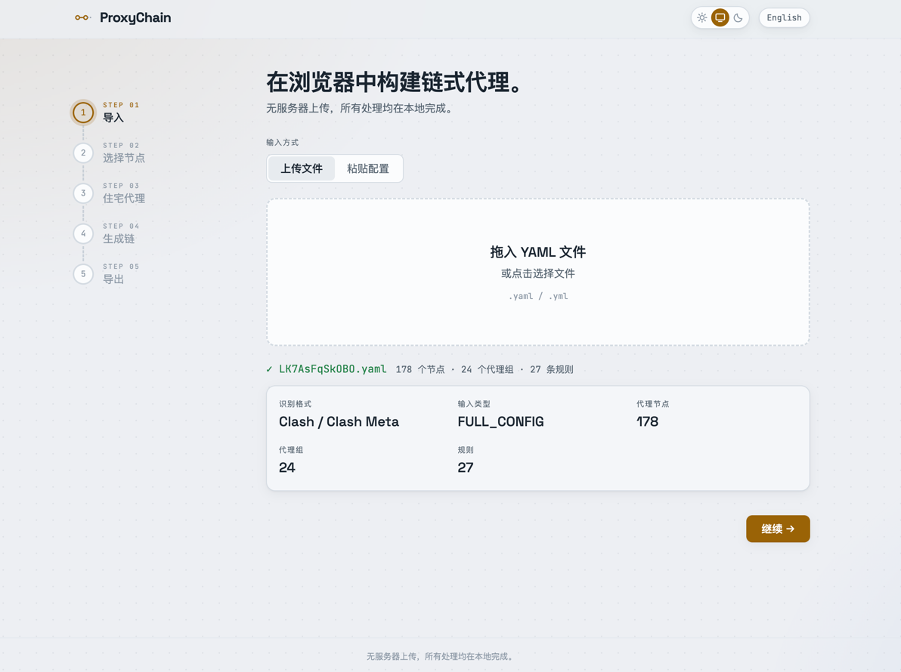
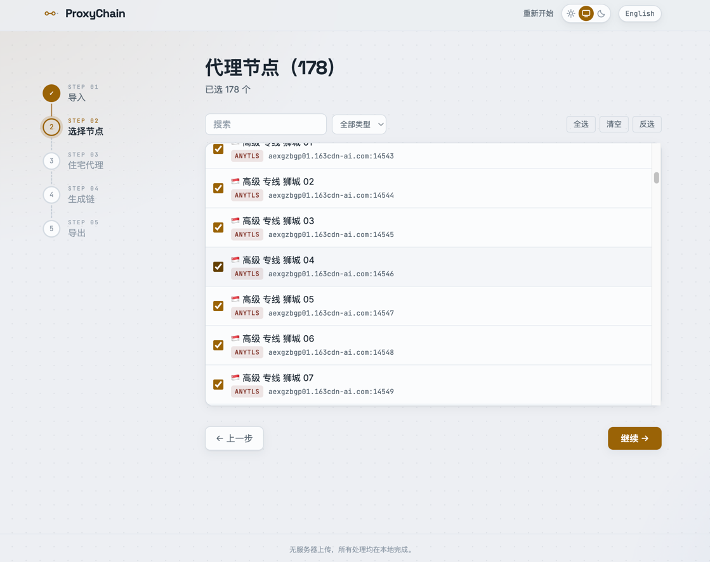
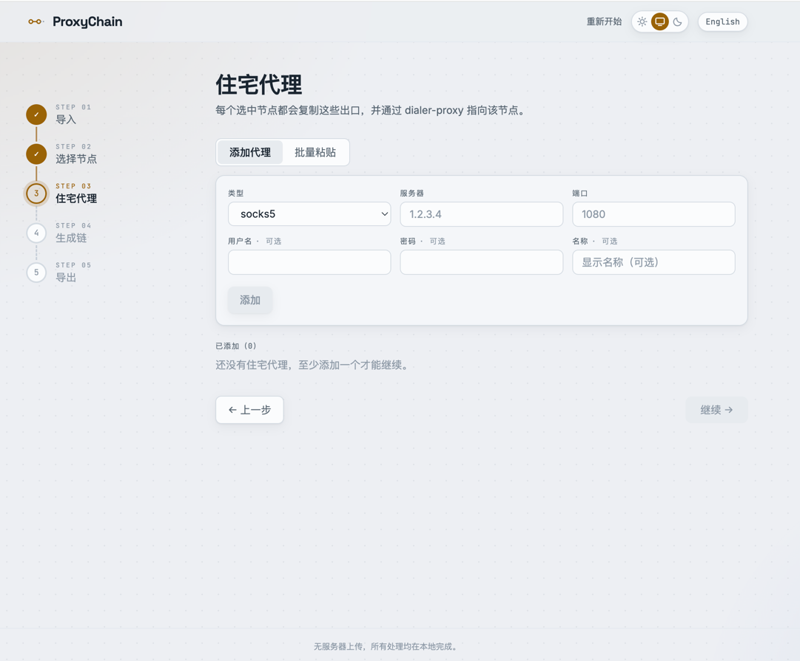
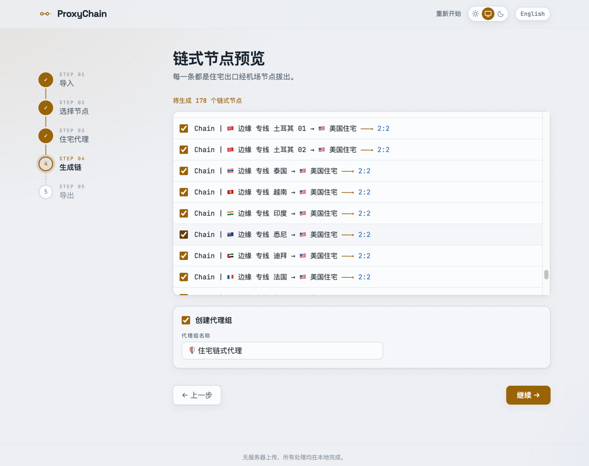
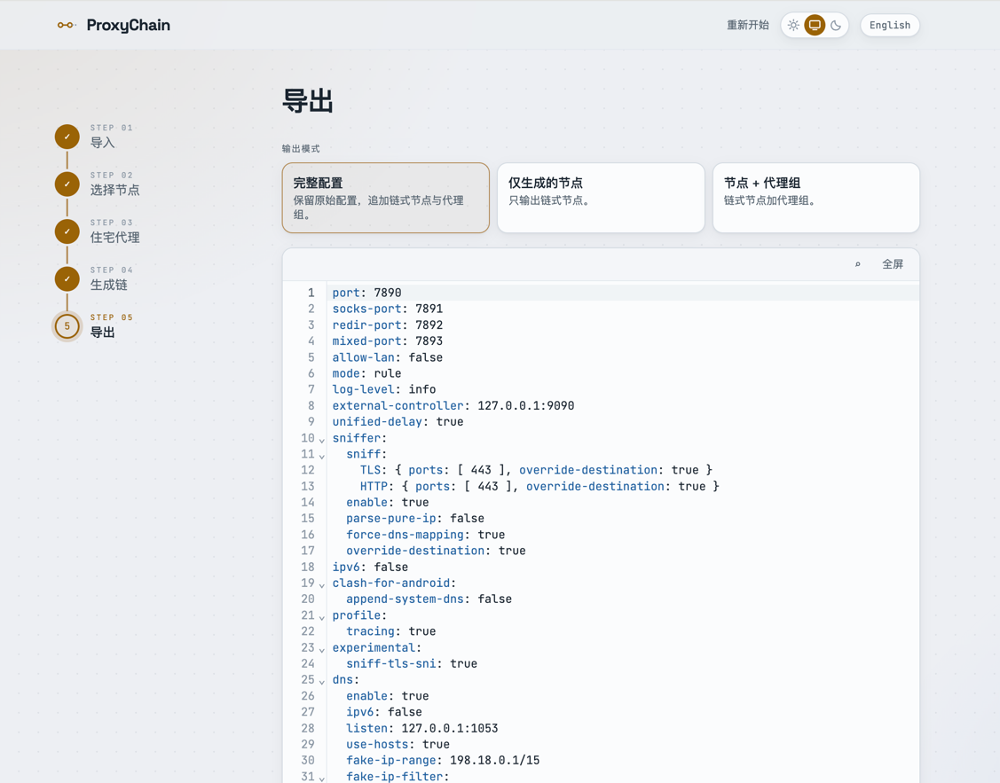

# ProxyChain

[English](./README.md) | **简体中文**

在浏览器中构建 Clash 链式代理。让流量先经过机场节点、再从住宅代理出口——
流量 → 机场节点 → 住宅代理 → 目标网站——五步向导完成配置，全程无服务器上传。

**→ [flowers-hurt.github.io/ProxyChain](https://flowers-hurt.github.io/ProxyChain/)**

所有处理都在浏览器本地完成，你的配置不会离开你的设备。

## 为什么做这个

大多数工具只接受一份完整、合法的 Clash 配置文件。ProxyChain 是配置的
*转换器*，而不是校验器：无论是完整配置、只有 `proxies:` 的片段、一段裸的
代理列表，还是粘贴的单个节点，它都能识别其中的代理节点，并生成链式代理配置。

> 尽可能地解析。识别代理节点而不因缺字段拒绝输入。精确地生成。把控制权留给用户。

## 功能

- **三种导入方式** —— 上传 `.yaml`/`.yml`、粘贴到 YAML 编辑器，或直接丢几行代理进来。
- **自动识别输入类型** —— `FULL_CONFIG`、`PROXIES_SECTION`、`PROXY_LIST`、
  `SINGLE_PROXY` 或 `UNKNOWN`。不完整的配置是一等公民，不是错误。
- **协议无关** —— 代理 `type` 从不硬编码。ss、vmess、vless、trojan、
  hysteria2、tuic、anytls、wireguard……全部透传，未知字段原样保留。
- **链式代理** —— 选中的节点 × 住宅出口，笛卡尔积组合，通过 Clash Meta 的
  `dialer-proxy` 实现。
- **完整配置无损输出** —— 原始文档（注释、`dns`、`tun`、`sniffer`、未知键）
  全部保留，ProxyChain 只做追加。绝不凭空生成 `mixed-port` / `rules` / `dns` / `tun`。
- **灵活导出** —— 完整配置、仅生成的代理，或代理 + 代理组。可复制或下载。
- **双语界面** —— English / 中文。

## 工作原理

```
完整配置 ─────┐
配置片段 ─────┤
代理列表 ─────┼──▶ 解析器 ──▶ ProxyChain 引擎 ──▶ YAML
粘贴的节点 ───┘

输入 → 语法解析 → 结构检测 → 归一化 → 代理提取 → 链式引擎
```

## 五步向导

1. **导入** —— 上传、粘贴或拖入你的配置

   

2. **选择节点** —— 挑选要参与组链的机场节点

   

3. **住宅代理** —— 通过表单、`host:port:user:pass` 或 YAML 添加出口

   

4. **生成链** —— 预览 `dialer-proxy` 节点和可选的代理组

   

5. **导出** —— 复制或下载结果

   

## 本地开发

```bash
npm install
npm run dev      # 本地开发服务器
npm test         # Vitest —— 解析器、链式生成器、输出器
npm run build    # 生产构建
```

核心逻辑（`src/core/`）是零 UI 依赖、测试全覆盖的纯 TypeScript；
向导界面（`src/ui/`）是其上的 React 应用。

## 技术栈

React · Vite · TypeScript · Tailwind CSS · CodeMirror 6 · [`yaml`](https://github.com/eemeli/yaml) · zustand · react-i18next · Vitest

## 部署

推送到 `main` 分支即由 GitHub Actions 构建并发布到 GitHub Pages。
Vite 的 `base` 默认为 `/ProxyChain/`，部署到其他环境时用 `VITE_BASE`
覆盖（例如根域名或 Vercel 用 `VITE_BASE=/ npm run build`）。

## 隐私

没有后端。没有上传。没有统计埋点。代理凭据和配置只存在于你的浏览器里。
